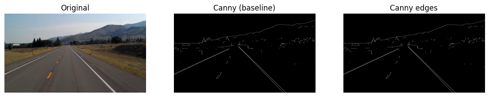
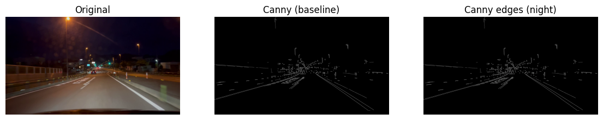
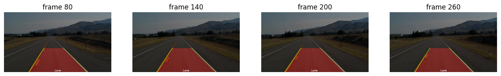
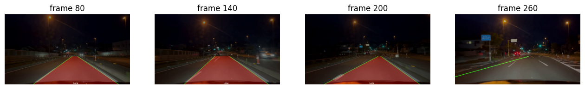

# Lane Detection (Classical CV)

Classical lane line detection using Canny + HoughLinesP with ROI and temporal smoothing,
evaluated on simple daytime vs challenging night/urban road conditions.

## Project structure

- `lane_detection.ipynb` — main notebook  
  - data loading (Kaggle videos),
  - Canny baseline visualization,
  - running `LaneDetector` on simple & hard videos,
  - frame-level visualization.
  - [Open in Colab](https://colab.research.google.com/drive/1Qlnsk7351wMEJGysBds6A8k4zFH4knQ2?usp=sharing)
- `src/lane_detector.py` — implementation of the proposed lane detection pipeline.
- `src/canny_baseline.py` — simple Canny-based baseline on video frames.
- `requirements.txt` — project dependencies.
- `figures/` — example result frames.

## Baseline vs Proposed

**Baseline (`src/canny_baseline.py`):**
- Grayscale + Canny edge detection on each frame.
- Shows all edges; no robust lane separation.

**Proposed method (`src/lane_detector.py`):**
- Grayscale + Gaussian blur
- Canny edges
- Road region of interest (trapezoid)
- Probabilistic HoughLinesP
- Filtering by slope and position (left/right)
- Temporal smoothing of lane lines
- Lane area highlighting ("Lane" between left and right line)

## Example results

Simple daytime highway:



Challenging night / urban:



The baseline shows many edges and noisy structures and does not provide a clear lane geometry.

### Proposed method: LaneDetector

Simple daytime highway (detected lane area is stable and meaningful):



Challenging night / urban (unstable / failing in many frames):


This visual comparison illustrates:

- classical Canny-based baseline is not sufficient,
- the proposed pipeline works well in easy conditions,
- both approaches struggle in complex real-world scenarios, which motivates more robust methods.

- On the simple video, the proposed method produces clear and stable lane markings.
- On the challenging video, detections are often unstable or incorrect,
  which demonstrates the limitations of classical CV methods in real-world conditions.

## Heuristic evaluation

Since we do not have ground-truth lane annotations, we use a simple consistency check:

A frame is counted as **valid** if:
- both lane lines are detected;
- left line is on the left side, right line on the right;
- lines lie in the lower (road) area of the frame.

Results:
- Simple daytime highway: **~71%** valid frames
- Challenging night / urban: **~3%** valid frames

This heuristic confirms the visual observation:
classical CV pipeline works reasonably well in easy conditions,
but becomes highly unstable in challenging environments.

## How to run

1. Install dependencies:

```bash
pip install -r requirements.txt
